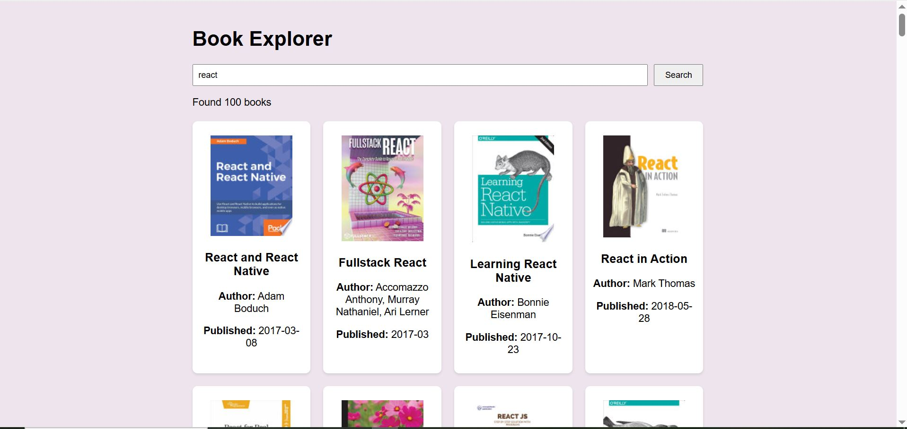
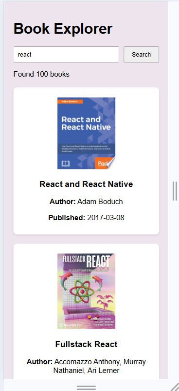

# Book Explorer App

## Overview

The **Book Explorer** app allows users to search for books, view detailed information about them, and explore a wide range of books from the Google Books API. This app supports both desktop and mobile views, ensuring an optimal experience for users across devices.

## Features

- **Search Books**: Users can search for books by entering a keyword in the search bar.
- **Book Details**: Click on any book to view detailed information, including the title, author(s), publication date, and description.
- **Infinite Scrolling**: As users scroll down, more books are automatically loaded, allowing them to explore a vast collection.
- **Mobile-Responsive**: The app is fully responsive and adapts seamlessly to different screen sizes.

## User-Friendly Interface

The app is designed with a clean and user-friendly interface, making it easy for users to search, explore, and view book details without any hassle. It offers smooth navigation across both desktop and mobile platforms.

## Screenshots

### Desktop View



### Mobile View



## How to Run

1. Clone the repository:

   ```bash
   git clone https://github.com/msheraz2022skipq/book_explorer_app.git
   ```

2. Navigate to the project folder:

   ```bash
   cd book-explorer
   ```

3. Install dependencies:

   ```bash
   npm install
   ```

4. Run the app:

   ```bash
   npm start
   ```

5. Open your browser and go to `http://localhost:3000` to see the app in action.

## Technologies Used

- React
- Google Books API
- CSS for styling

